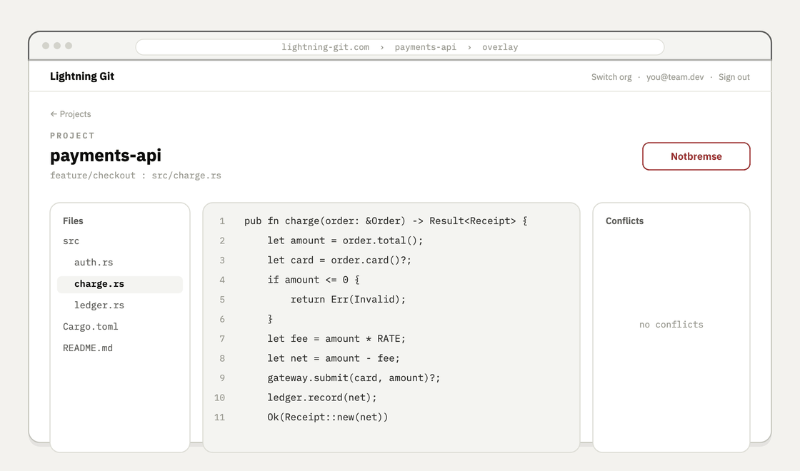
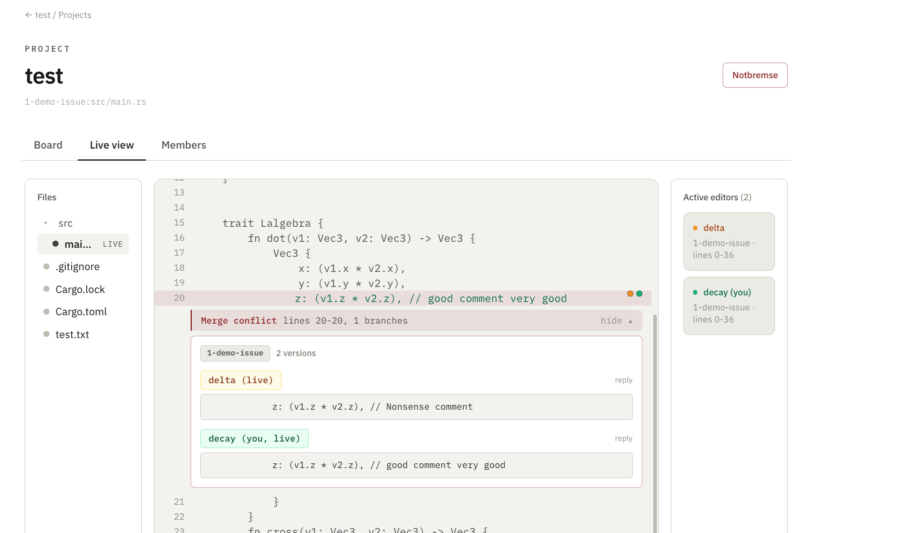
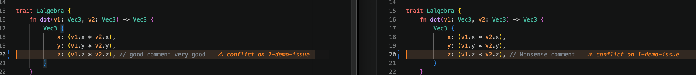
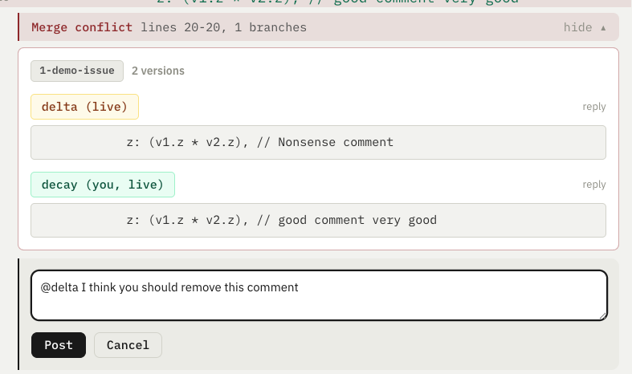
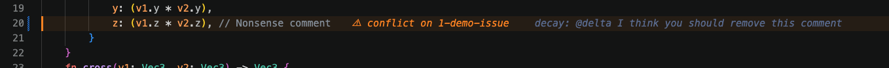
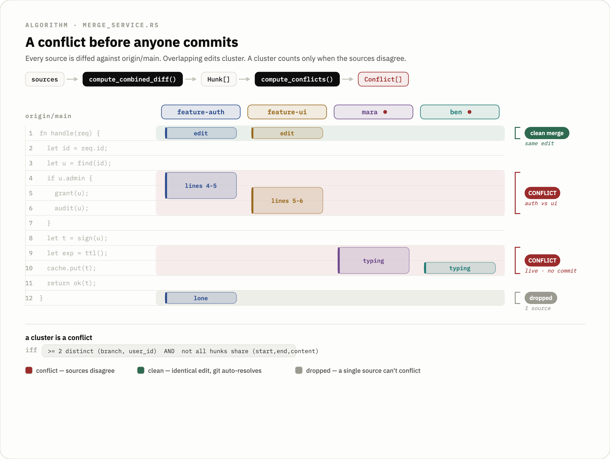

# Lightning Git

  

Git only shows you a teammate's work once they commit and push. Everything before that, the file they have open right now, the function they are halfway through rewriting, the line two of you are both editing on different branches, is invisible until it lands as a conflict in a pull request. Lightning Git closes that gap. It mirrors a repository read-only, holds each person's uncommitted edits as live overlay state in the backend's RAM, and streams that state to the rest of the team, so you can see who is editing which file, where two branches are diverging, and which merge conflict is forming, while everyone is still typing and before any commit exists.

<p align="center">
  
</p>

Nobody changes how they work. You keep committing, branching, and merging in your own Git exactly as before. Lightning Git never writes to your repository; it only watches and reports.

<p align="center">
  
</p>

## What is in this repository

The product is three pieces around one backend, each kept as a self-contained subfolder with its own toolchain, build, and full history.

- [`backend/`](backend) (Rust, actix-web) is the engine. It owns the read-only mirror clones, the in-RAM overlay state, the per-file WebSocket layer, and the conflict prediction. It is the only place the conflict algorithm runs.
- [`frontend/`](frontend) (Vue 3, TypeScript, Vite, Pinia) is the web dashboard. It renders the same realtime overlay the editor shows, so a non-coding stakeholder like a Scrum Master or Product Owner can watch the live state of the code in a browser without cloning anything.
- [`extension/`](extension) (VS Code, TypeScript) is the developer's surface. It shows teammates' edits and the predicted conflicts inside the editor where the work actually happens.

The conflict algorithm lives in exactly one place, the backend. It computes the conflict set and pushes it over the WebSocket, and both the frontend and the extension render what the backend sends rather than each carrying their own copy of the logic. Two clients that only display the server's result can never drift from the server or from each other, which is the whole reason an earlier pair of hand-ported copies was deleted.

The marketing page is not part of the product and is not in this repository. It lives on its own at [lightning-git-landing](https://github.com/191-iota/lightning-git-landing) and is served at [lightning-git.com](https://lightning-git.com); that domain is the landing page only, not a running instance you can sign into.

## What it looks like

The web dashboard's live view: two people editing the same line on one branch, with the forming merge conflict laid out as each person's version, who is editing right now, and the Notbremse, all before anyone commits.

<p align="center">
  
</p>

The same conflict inside VS Code, where the work actually happens. Each side is tinted in the editor and the affected line carries an inline badge naming the branch it clashes on.

<p align="center">
  
</p>

Every conflicting version is credited to its author, and teammates can talk it out on the line itself. Comments render inline in the editor too.

<p align="center">
  
</p>

<p align="center">
  
</p>

## How conflict prediction works

<p align="center">
  
</p>

Git has no notion of a conflict until you merge. Lightning Git detects one while two people are still typing, because it treats live, uncommitted, in-RAM edits as just another diff source. The backend reads `origin/main` as the base, then assembles every source against it: each user's live overlay content out of the in-memory map, plus any other branch read straight from `origin`. Live typing and committed branches feed the same code path, so prediction and ordinary diffing are one algorithm.

Each source is diffed against the base with the `similar` crate, and the resulting hunks are placed on the base-line coordinate system so hunks from different sources can be compared directly. A single forward sweep over the sorted hunks merges everything that overlaps into one cluster, and the merge is transitive: if A overlaps B and B overlaps C, all three land in the same cluster even when A and C do not touch. A cluster is a real conflict only under two rules. It needs at least two distinct `(branch, user_id)` sources, so two people editing the same branch with divergent live content count as a genuine collision, the most common realtime case and one that committed-Git diffing can never see. And if every hunk in the cluster makes the identical edit, the cluster is dropped, because Git would auto-resolve that on its own.

The backend recomputes this set when a client connects and again on every overlay edit, then broadcasts it over the same per-file WebSocket the edits already flow through. Nothing polls for conflicts, and a conflict the backend has resolved simply drops off the next message. The [backend README](backend) has the full algorithm, the locking discipline around it, and the test coverage.

## Realtime, and safe by construction

The backend never writes to your Git. The only file that shells out to git uses a fixed, read-only set of commands (`fetch --prune`, `clone`, `branch -r`, `ls-tree`, `show`), so the server cannot corrupt or rewrite history and needs no write credentials. The cloned working copy on disk is disposable; it is a projection of `origin` that the backend creates when a project is added, so a host can run on an ephemeral filesystem and never has to back the clones up.

Live state is deliberately ephemeral. Overlays, comments, and the predicted-conflict set live only in RAM and are gone on restart; the only thing that persists is account, project, task, and membership metadata in six Postgres tables on Supabase. Every realtime message travels on a per-file broadcast channel, an edit reaches the other editors of that file in one hop and is self-filtered back to its author so a typist never fights their own cursor.

The Notbremse (the German term for an emergency brake, kept as a product name) is the safety valve this design buys. One call resets the caller's in-flight edits on every file in a project back to the committed base and tells teammates to revert, without touching git. It exists for credential safety: if a secret gets typed into an overlay, one button discards it from backend RAM everywhere before it sits any longer. It is a reactive control, so it only helps if the user notices, but because live state is bounded by RAM rather than written anywhere, the reset is instant and complete.

## Why one flat repository

Each package keeps its own lockfile and builds on its own. There is no root workspace and no shared `node_modules`. A deploy host points at a single subfolder and never has to understand the rest of the repo, and the VS Code extension is packaged without the dependency-hoisting surprises a shared install would cause. The cost is that the two Node packages install separately; for three pieces that ship to different places, that is the cheaper trade.

## Running it locally

Each package has its own README with the real detail. In short:

```bash
# backend: needs Rust + git on the host and a Supabase project (see backend/.env.example)
cd backend && cargo run

# frontend: needs Node; VITE_API_BASE_URL points at the backend
cd frontend && npm ci && npm run dev

# extension: open extension/ in VS Code and press F5 to launch an Extension Host
```

## Deployment

Every package deploys from its own subfolder. [DEPLOYMENT.md](DEPLOYMENT.md) has the per-package host settings: the Docker build context for the backend, the base directory and output for the frontend, and `vsce` for the extension.

There is no public instance you can sign into. To use Lightning Git you host it yourself from these subfolders.

## CI

[`.github/workflows/ci.yml`](.github/workflows/ci.yml) checks only the packages a change touches. The backend builds and runs its tests, the frontend type-checks and builds and tests, and the extension compiles and lints and tests.

## License and attribution

Lightning Git is released under the [MIT License](LICENSE), Copyright (c) 2026 191-iota, and each package also carries its own copy. MIT lets you use, fork, change, and build on the code, including in commercial work. The one thing it asks in return is attribution. Every copy or substantial portion, including a fork or an expanded version, must keep the license text and the `Copyright (c) 2026 191-iota` notice intact, so the original authorship stays with the code wherever it goes. The license does not oblige you to credit 191-iota in your product's interface, only to preserve the copyright and license notice in the source.

The repository also carries its complete development history, every commit from all three packages, which is itself the record of how it was built. Releases are published as signed tags; see [AUTHORSHIP.md](AUTHORSHIP.md) for how to verify them and what the signature proves.
