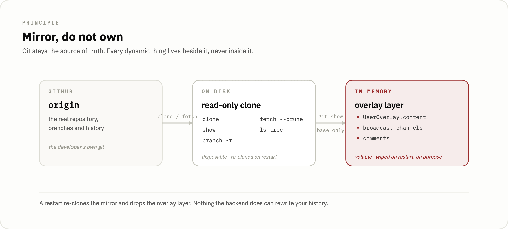
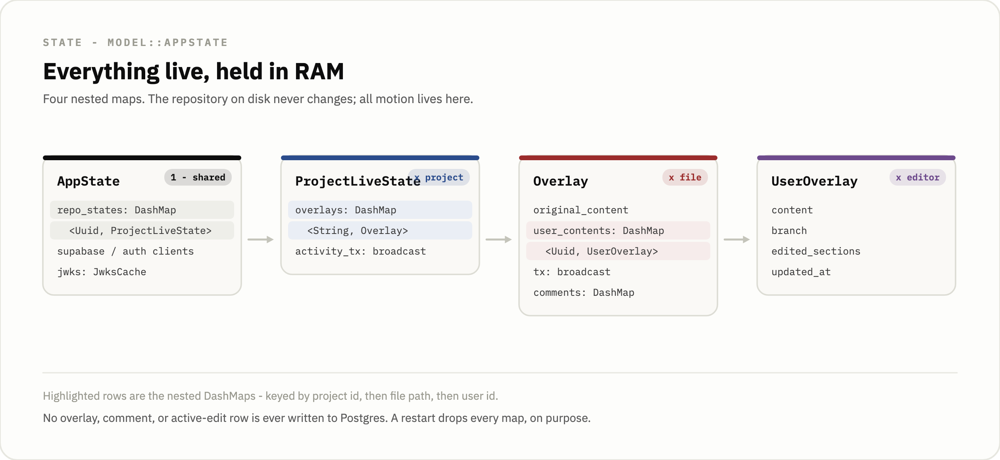
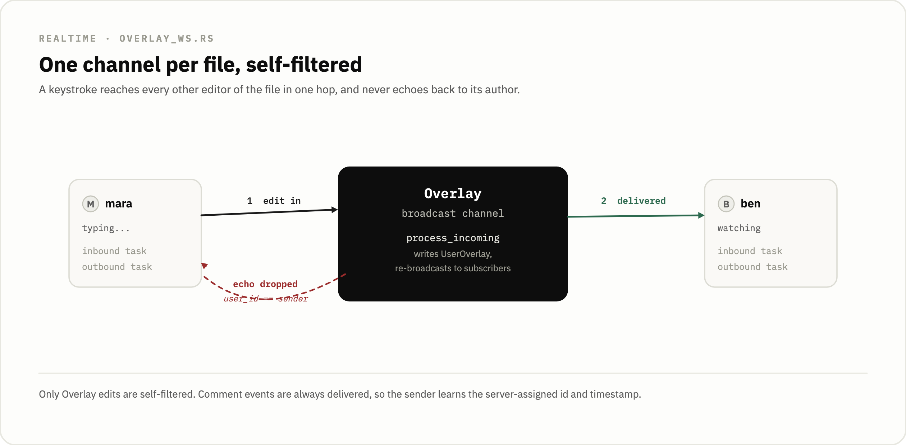
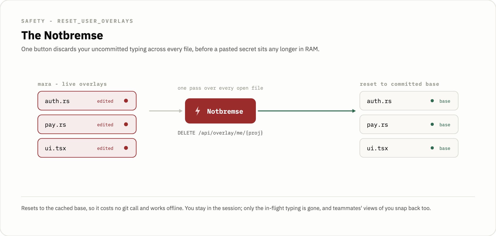
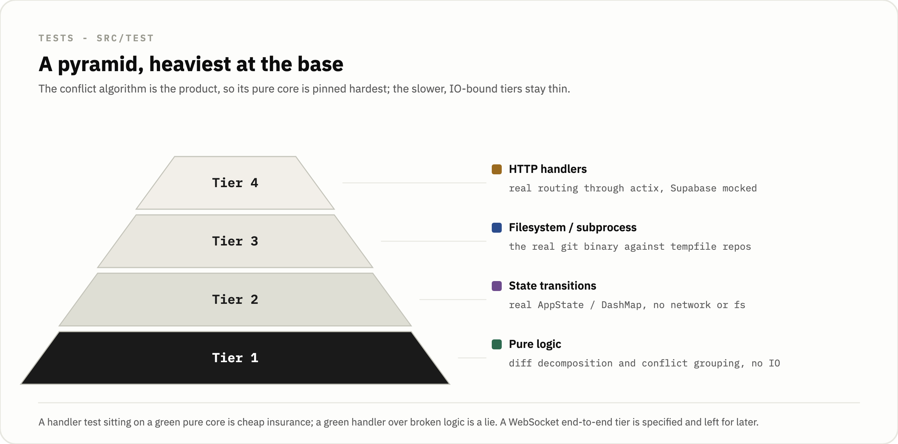

# lightning-git-backend

   

The Rust engine behind Lightning Git. It clones each GitHub repository as a read-only mirror, holds every in-flight edit in RAM, streams those edits to teammates over per-file WebSockets, and predicts merge conflicts while people are still typing — before any commit exists.

Lightning Git is a realtime visibility layer on top of Git. A team keeps committing and merging exactly as before, but the gap between writing code and pushing it stops being a blind spot: you can see who is editing which file, whose lines are diverging, and which merge conflict is forming, live. The product is three repositories around this one backend:

- `lightning-git-backend` (this repo) — Rust + actix-web. Owns the mirror clones, the overlay state, the realtime layer, and conflict prediction.
- [lightning-git-frontend](https://github.com/191-iota/lightning-git-frontend) — Vue 3 + TypeScript + Vite + Pinia. The web dashboard for the whole team, including non-coding stakeholders like a Scrum Master.
- [lightning-git-vsc](https://github.com/191-iota/lightning-git-vsc) — the VS Code extension, the developer's surface inside the editor.

Live at [lightning-git.com](https://lightning-git.com). It is an early-stage, self-hostable project, so read the scope section before treating any of this as production software.

<p align="center">
  
</p>

<p align="center">
  
</p>

## Mirror, do not own

Git is the source of truth and this backend never writes to it. The only file in the codebase that runs a git subprocess is `src/service/git_service.rs`, and the complete set of argument vectors it ever passes is `["fetch", "--prune"]`, `["clone", src, dst]`, `["branch", "-r"]`, `["ls-tree", "-r", "--name-only", spec]`, and `["show", spec]`. There is no commit, add, push, merge, checkout, or reset anywhere. `read_file` builds its spec as `origin/{branch}:{file_path}` and `list_files` as `origin/{branch}`, so every read goes against a remote-tracking ref. `delete_repo` just calls `tokio::fs::remove_dir_all`.

Keeping git read-only means the server can never corrupt or rewrite a user's history, never leaves a dirty working tree, and needs no write credentials. All the hard write-side work, resolving conflicts and making commits, stays in the developer's own git. The cloned working copy on disk is disposable; it is a projection of `origin` that could be re-cloned at any moment, which is exactly what happens on every container restart.

<p align="center">
  
</p>

Burst reads on the same repo collapse to a single network fetch. `maybe_fetch` checks a per-repo `LAST_FETCH` timestamp against a 30-second `FETCH_TTL` and returns early if the repo was just fetched; otherwise it takes a per-repo `Arc<Mutex<()>>` and re-checks the timestamp after acquiring the lock. This double-check matters because `calculate_live_diff` fires many parallel `read_file` calls, and without serialization each would spawn its own `git fetch` and the processes would contend on git's `index.lock` and hang the merge endpoint. The common hot path, where the repo was fetched seconds ago, never even touches the mutex.

## Conflict prediction before a commit exists

Git has no concept of a conflict until you merge. This backend detects one while two people are still typing, because it treats live, uncommitted, in-RAM edits as just another diff source.

`calculate_live_diff` in `src/service/merge_service.rs` reads `origin/main:{file}` as the base, then assembles a list of sources. `extract_overlay_file_contents` pulls every `UserOverlay.content` out of the in-memory `DashMap` — that is the raw text a user is typing over their WebSocket, never persisted — and each becomes a source tuple `(branch, Some(user_id), content)`. Branches that have no live overlay are read from `origin/{branch}:{file}` concurrently with `buffer_unordered(10)`, and each becomes `(branch, None, content)`. Live typing and committed branches feed the same algorithm, so prediction and ordinary diffing share one code path. If `main` has no such file yet — a draft not committed to `main` — there is no merge target and the call returns an empty `Vec`.

<p align="center">
  
</p>

`compute_combined_diff` turns each source into hunks by running `TextDiff::from_lines` from the `similar` crate against the base and walking the changes. A source identical to the base, or whitespace-only (a deleted or emptied file), is skipped so it doesn't clutter the result. Each `Hunk` carries its `branch`, an `Option<Uuid>` user id, and the base-line range it touches. Inserts widen the hunk's content without widening its base range; deletes consume a base line. The base offsets are what let hunks from different sources be compared on the same coordinate system.

`compute_conflicts` then sorts all hunks by `(base_start, base_end)` and does a single forward sweep. If a hunk's `base_start` is at or before the running end of the current group it joins that group and the running end extends via `cmp::max(running_end, hunk.base_end)`; otherwise it starts a new group. That `max` is what makes the grouping transitive: a long early hunk pulls in later hunks that overlap only its extended boundary, so if A overlaps B and B overlaps C, all three land in one cluster even when A and C don't touch. It is the classic sorted interval-merge, giving the same transitive closure a union-find would, in `O(n log n)` and without the data structure, because line ranges are one-dimensional. The test `three_branches_overlapping_produces_single_conflict_group` pins this with hunks `[0,3]`, `[2,5]`, `[4,7]` collapsing to one group of three.

Two rules decide whether a cluster is actually a conflict. The source set is built as a `HashSet` of `(branch, user_id)` rather than just `branch`, so two people editing the *same* branch with divergent live content count as two distinct sources and conflict with each other — the most common real-time collision, and one that committed-git diffing can never see. A cluster needs at least two distinct sources to survive. Then `hunk_signature` returns `(base_start, base_end, &content)`, and if every hunk in the cluster shares the first one's signature the cluster is dropped, because two branches that made the identical edit will merge cleanly and git would auto-resolve it anyway.

Conflicts are pushed, not polled. The backend recomputes `calculate_live_diff` when a client connects and again on every overlay edit, and broadcasts the result as `WsBroadcast::Conflicts { file, conflicts }` over the same per-file overlay WebSocket the edits already flow through, so a client renders the fresh set without asking for it and replaces its whole conflict list on each message. The recompute also refreshes each overlay's cached base from the fresh `main` read it just did and re-broadcasts the activity snapshot, reusing the unavoidable fetch instead of paying for a second round-trip. Each call site `.await`s `calculate_live_diff` with no `DashMap` guard held, because it takes a write guard on the same shard via `refresh_overlay_base` and a guard held across the await would deadlock against it — the same trap the old merge endpoint had to document.

## The overlay model

`AppState` is `Clone` and holds a `DashMap<Uuid, ProjectLiveState>` keyed by project id, plus the Supabase clients, the clone directory, and a shared `JwksCache`. Each `ProjectLiveState` holds a `DashMap<String, Overlay>` keyed by filename and one project-wide `activity_tx` broadcast channel. An `Overlay` holds the cached `original_content` (the base from `git show`), a `DashMap<Uuid, UserOverlay>` keyed by user id, its own per-file `broadcast::Sender<WsBroadcast>`, and an in-memory `DashMap<Uuid, Comment>`. Every broadcast channel is created with capacity 128. Nothing here is persisted; a restart wipes all of it on purpose, and the file metadata that does persist lives in six Supabase tables.

```rust
#[derive(Clone)]
pub struct Overlay {
    pub original_content: String,                  // cached base from git show
    pub user_contents: DashMap<Uuid, UserOverlay>, // Key: user id
    pub tx: broadcast::Sender<WsBroadcast>,        // per-file channel
    pub comments: DashMap<Uuid, Comment>,          // in-memory, lost on restart
}
```

<p align="center">
  
</p>

Opening a file goes through `PUT /api/overlay/{project_id}/{user_id}/{file_name}?branch={b}`. The branch is a query parameter, not a path segment, because both the branch name and the file path can contain slashes; the `{file_name:.*}` tail regex captures the rest of the path. `AppState::get_or_create_overlay` always refreshes `original_content` from git and treats a re-create as a fresh session, resetting the caller's content and divergence. `AppState` exposes nine public methods in total, including `ensure_file_overlay`, which makes an `Overlay` exist for viewer-only subscribers *without* inserting a `UserOverlay`, so a web viewer watching a file doesn't show up as editing it.

## Realtime over per-file WebSockets

<p align="center">
  
</p>

Each file has its own broadcast channel and each connection spawns two tokio tasks: an outbound forwarder that seeds a `Snapshot` and then loops on `rx.recv()`, and an inbound consumer that loops on `stream.next()` and calls `process_incoming`. `ws_overlay_stream` builds the snapshot and subscribes inside a block scope so the `DashMap` refs drop before the WebSocket upgrade, because holding a lock across the upgrade `.await` would risk a deadlock. A `RecvError::Lagged` is treated as `continue` rather than fatal, which fixed a real bug where a second user joining during a busy moment never appeared.

The outbound task self-filters echoes:

```rust
let skip = !echo_self
    && match &msg {
        WsBroadcast::Overlay { user_id: u, .. } => *u == user_id,
        _ => false,
    };
if skip { continue; }
```

Only the `Overlay` variant is filtered. A typist never sees their own keystrokes bounced back to fight their cursor, but `CommentCreated`, `CommentDeleted`, and `Snapshot` fall through to `_ => false` and are always delivered — the originating client needs the server-assigned comment id and `created_at` back, and one boolean expression solves both the echo problem and the id round-trip without a second channel. `echo_self` comes from `req.query_string().contains("echo=true")`, which the web viewer sets so it sees its own edits and which makes the socket observable in tests.

On WebSocket close, `user_contents` is deliberately *not* removed, because one `user_id` can hold several sockets at once — a web viewer and a VS Code editor — and first-close cleanup would wipe the other session's live data.

## Notbremse

<p align="center">
  
</p>

The Notbremse (the German term for an emergency brake, kept as a product name) is a panic button. `DELETE /api/overlay/me/{proj_id}` resets the calling user's in-flight edits on every file in the project back to the committed base and tells teammates to revert. It exists for credential safety: if a secret gets typed into an overlay, one button discards it everywhere before it sits any longer in backend RAM. It is a reactive control, so it only works if the user notices and it cannot unsend edits already broadcast — but the dwell time is bounded by RAM, and the reset itself is instant.

```rust
pub fn reset_user_overlays(&self, project_id: &Uuid, user_id: &Uuid) -> usize {
    let Some(proj) = self.repo_states.get(project_id) else { return 0; };
    let mut reset_count = 0usize;
    for overlay in proj.overlays.iter() {
        let base = overlay.original_content.clone();
        let tx = overlay.tx.clone();
        let mut touched = false;
        if let Some(mut uo) = overlay.user_contents.get_mut(user_id) {
            uo.content = base.clone();
            uo.edited_sections = (0, 0);
            uo.updated_at = Instant::now();
            touched = true;
        }
        if touched {
            reset_count += 1;
            let _ = tx.send(WsBroadcast::Overlay { user_id: *user_id, content: base, line_section: (0, 0) });
        }
    }
    let activity_tx = proj.activity_tx.clone();
    drop(proj); // release read guard before compute_activity re-acquires shard locks
    let _ = activity_tx.send(self.compute_activity(project_id));
    reset_count
}
```

It resets to the cached base rather than reading git again, so it costs no subprocess and works even if the network is down. The user stays in the session; only their uncommitted typing is gone. The read guard is dropped before `compute_activity` runs because that recomputation re-acquires the same `DashMap` shard locks and would otherwise self-deadlock. The handler logs `"Notbremse triggered"` and returns `{"reset": n}`.

## Auth and permissions

Authentication is delegated to Supabase. A single `auth_filter` middleware on the `/api` scope validates every JWT against the project's JWKS endpoint, derived as `{SUPABASE_URL}/auth/v1/.well-known/jwks.json`. The JWKS is fetched once at startup into a `JwksCache` on `AppState`; its `Arc<RwLock>` interior lets every actix worker share one cache instead of re-fetching per request or per worker. The filter accepts the token from the `Authorization` header or from a `?token=` query parameter, because a browser cannot set headers on a WebSocket handshake and that fallback is the only practical way to authenticate the upgrade.

On auth failure the middleware returns the 401 as `Ok(ServiceResponse)`, not `Err`. Returning `Err` would skip the outer CORS wrap and the browser would see a CORS error masking the real cause; threading the response back as `Ok` keeps `Access-Control-Allow-Origin` attached.

Authorization lives in four declarative macros — `require_project_permission!`, `require_project_admin!`, `require_org_permission!`, `require_org_owner!` — that each expand to a match and `return` an `HttpResponse` directly from the handler on failure, so the gate is one readable line at the top of each protected handler and easy to spot if missing. They all funnel through two functions in `permission_service.rs`. `check_project_permission` first calls `is_org_owner_of_project` and short-circuits with `Ok(true)`, so an org owner passes every project check without a `project_members` row, and the "owner sees everything" rule lives in exactly one place instead of being scattered across handlers.

The data plane and the auth plane use different Supabase keys. The `SupabaseClient` uses `SUPABASE_API_KEY` (service_role) because RLS on `profiles` only grants `SELECT` to anon and a write with the wrong key silently affects zero rows; the `AuthClient` uses `SUPABASE_ANON_KEY` for gotrue calls. The trusted server bypasses RLS for data access and enforces authorization in Rust through the macros instead.

One honest gap: the two WebSocket handlers, `ws_overlay_stream` and `ws_project_activity`, check the JWT (via the `/api` scope filter) but do *not* verify the authenticated user is a member of the project, so a holder of any valid token can open a project's activity or overlay socket without belonging to it. The sibling HTTP overlay handlers all gate with `require_project_permission!`. Within the socket, `CommentDeleted` is owner-only, but project membership is not checked on connect.

## Routes

Thirty-seven routes total: thirty-one under the JWT-protected `/api` scope, six anonymous. The realtime and overlay surface:

| Method | Path | Handler |
|---|---|---|
| GET | `/api/projects/{id}/activity/ws` | `ws_project_activity` (WebSocket) |
| GET | `/api/overlay/ws/{project_id}/{user_id}/{file_name:.*}` | `ws_overlay_stream` (WebSocket; pushes overlay edits and predicted conflicts) |
| GET | `/api/overlay/{project_id}/{user_id}/{file_name:.*}` | `get_overlay` (snapshot) |
| PUT | `/api/overlay/{project_id}/{user_id}/{file_name:.*}` | `create_active_overlay` (branch via `?branch=`) |
| DELETE | `/api/overlay/me/{proj_id}` | `wipe_my_overlay` (Notbremse) |

The rest cover projects, tasks, organizations, members, and the file tree. The anonymous scope is `/health`, `/register`, `/login`, `/refresh`, and the two GitHub OAuth callbacks. The full set is in `src/routes/global_routes.rs`, and Swagger UI serves a live copy at `/swagger/` with the spec at `/api-doc/openapi.json`.

## Persistence

Six Postgres tables in Supabase: `profiles`, `organization`, `organization_members`, `project`, `task`, and `project_members`. No overlay, comment, or active-edit state is ever written here — that lives only in the `AppState` DashMaps. `organization_members.role` is checked against `owner|member`, `project_members.role` against `admin|member`, and `task.kanban_column` against `todo|in_progress|review|merged`. A trigger `on_auth_user_created` runs `handle_new_user()` to auto-create a `profiles` row when an auth user is inserted. The canonical DDL is [`src/supabase/table_creation.sql`](src/supabase/table_creation.sql).

## Running locally

You need `git` on the host, a Rust toolchain, and a Supabase project.

```bash
# 1. Apply the schema once against your Supabase project
psql "$SUPABASE_URL_WITH_CREDS" -f src/supabase/table_creation.sql

# 2. Run
cargo run

# Swagger UI:  http://localhost:8080/swagger/
# Health:      http://localhost:8080/health   (also probes Supabase)
```

These environment variables are read at startup and the server panics if a required one is missing:

| Variable | Required | Notes |
|---|---|---|
| `SUPABASE_URL` | yes | also used to derive the JWKS URL |
| `SUPABASE_API_KEY` | yes | service_role, for data access |
| `SUPABASE_ANON_KEY` | yes | anon, for gotrue auth calls |
| `GITHUB_CLIENT_ID` | yes | OAuth app, for private-repo clones |
| `GITHUB_CLIENT_SECRET` | yes | |
| `GITHUB_CALLBACK_URL` | yes | |
| `GIT_REPO_DEV` | yes | directory for cloned repos, created at startup |
| `HOST` | no | defaults to `127.0.0.1` |
| `PORT` | no | defaults to `8080` |

The shipped `.env.example` lists only the Supabase and GitHub keys; you have to add `GIT_REPO_DEV` (required, the server panics without it) and the optional `HOST`/`PORT` by hand.

CORS is hard-wired to allow `http://localhost:5173` only, with methods GET/POST/PUT/PATCH/DELETE and a one-hour max-age. That is a prototype value and has to be made environment-driven before any real deployment.

## Testing

<p align="center">
  
</p>

Tests live under `src/test/` in four on-disk tiers, 63 functions in total. Run the fast tiers with `cargo test --lib` and the full suite, including the git-subprocess tests, with `cargo test`.

| Tier | What | Count |
|---|---|---|
| 1 | Pure logic — diff decomposition, conflict grouping, no IO | 20 |
| 2 | State management — real `AppState`/`DashMap`, no net or fs | 20 |
| 3 | Filesystem/subprocess — the real `git` binary against `tempfile` repos | 14 |
| 4 | HTTP handlers — `#[actix_web::test]`, real routing, mocked Supabase | 9 |

A fifth tier of WebSocket end-to-end tests is described in `src/test/README.md` but is not implemented. Because the conflict algorithm is the heart of the product, Tier 1 nails its edge cases directly — same-edit-is-not-a-conflict, single-source clusters dropped, edge-touching ranges merged into one group, the three-branch transitive chain.

## Project layout

```
src/
├── main.rs               # bootstrap, env, OpenAPI registration
├── config/               # JWT middleware, JwksCache
├── handler/              # REST + WS handlers, one file per resource
├── service/              # git, merge, overlay, permission, project
├── repository/           # Supabase wrappers (4 files, domain-grouped)
├── model/                # request/response types, AppState, Overlay
├── macros/               # require_*_permission! gating macros
├── routes/               # actix route registration + auth_filter
├── supabase/             # canonical DDL (table_creation.sql)
└── test/                 # tier_1..tier_4
```

## Scope

This is an early-stage prototype, not production software, and several things are deferred on purpose. Overlay state lives in an in-memory DashMap on a single instance and the broadcast is in-process, so running more than one backend would need shared state and cross-instance fan-out, for example via Redis Pub/Sub. The cloned repo is ephemeral in the container and re-fetched on every deploy, which slows cold start for large or numerous repos; a persistent volume would help.

The conflict algorithm lives in exactly one place now, this Rust backend: the frontend and the extension render the conflict set the backend pushes over the WebSocket instead of re-deriving it, so the two hand-ported copies that used to drift are gone. CORS is hard-wired as noted above. There is no error tracking like Sentry and no automated CI running the tiers on push; logging is plaintext to stdout via `env_logger` and the Actix `Logger`. Overlay content is protected in transit by TLS but sits in plaintext in backend RAM; application-level encryption is planned, not built. There is no rate limiting on public endpoints and no secret-rotation strategy. Live edits, predicted conflicts, and comments now all push over the per-file WebSocket; the earlier conflict poll is gone.

What runs today is the read-only mirror, the in-RAM overlays, the realtime layer, conflict prediction, the Notbremse, multi-tenant isolation, GitHub OAuth for private repos, and the backend test suite across four tiers.
