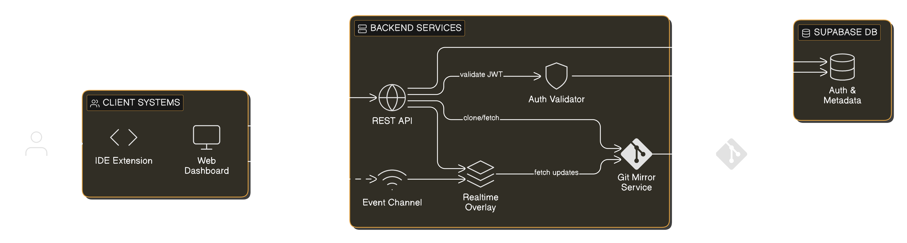
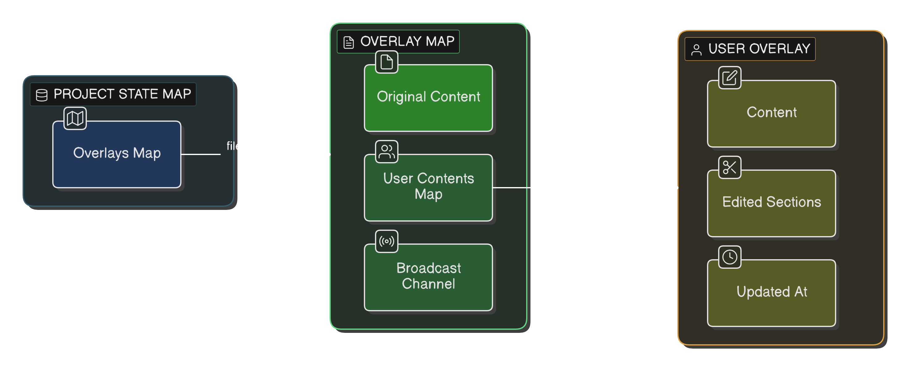
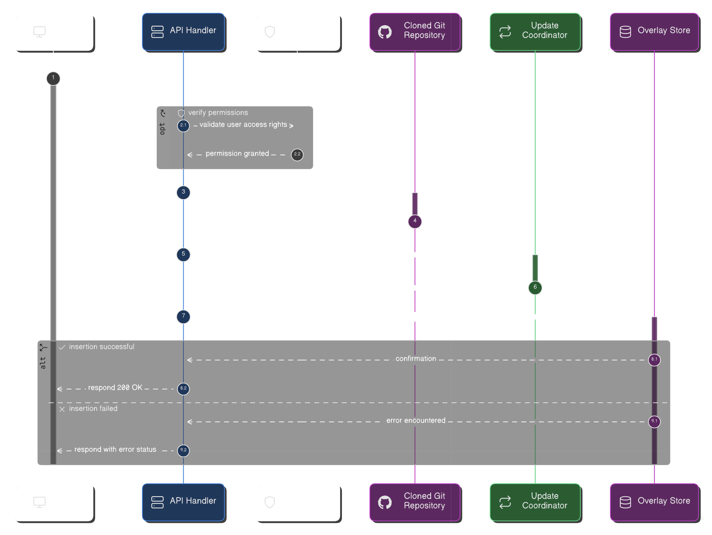
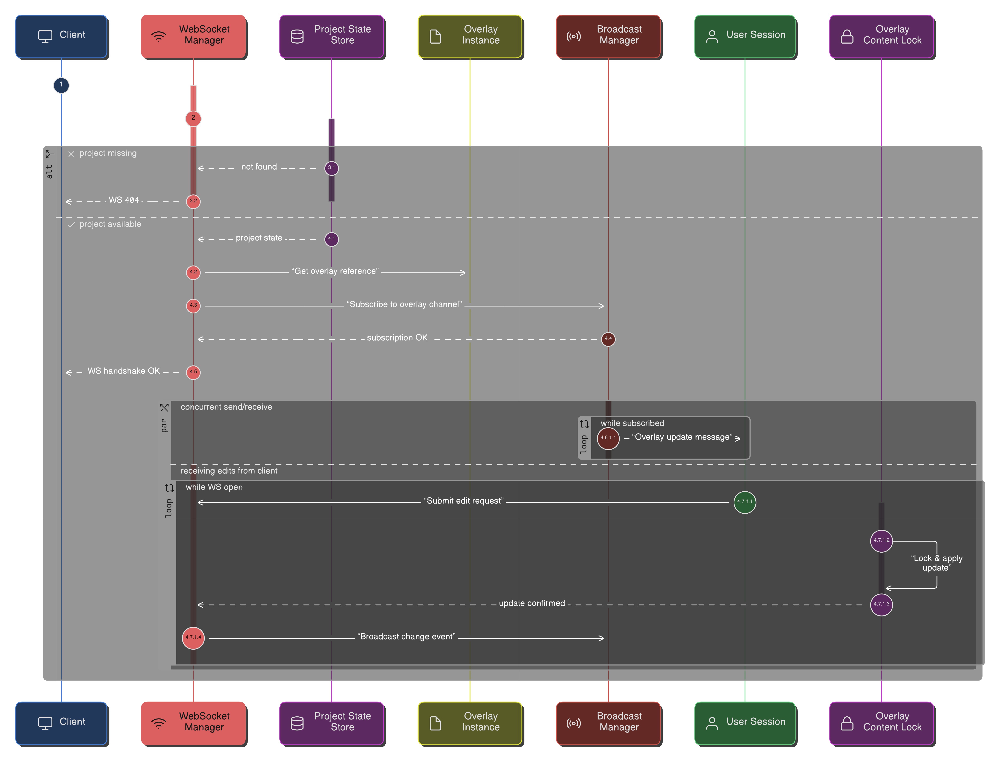
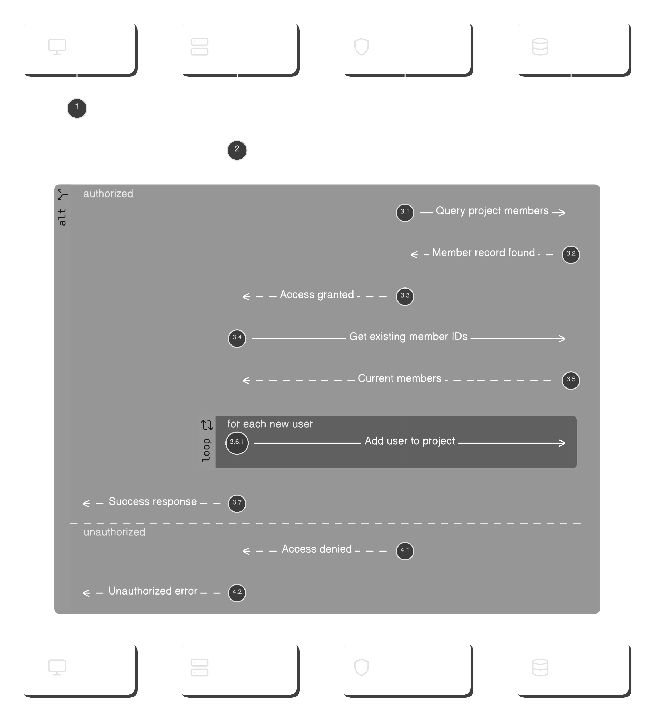

# hf-lightning-git-backend

The Rust + Actix-Web backend for Lightning Git. Owns the cloned repositories on
disk, the in-memory overlay state, the WebSocket realtime layer, and the merge
conflict detection service.

Requires `git` installed on the host.

## What is Lightning Git?

A realtime visibility layer built on top of Git. It lets a team see each
other's in-flight edits, catch merge conflicts before they happen, and drive a
Kanban board from the branch list, all without changing how anyone commits or
merges.

The product spans three repos:

- `hf-lightning-git-backend` (this one) — Rust + Actix-Web
- `hf-lightning-git-frontend` — Vue 3 + TypeScript
- `hf-lightning-git-vsc` — VSCode extension

## Why?

Slack and Jira sit next to the code instead of in it. Two developers can touch
the same lines for hours before anyone notices. Lightning Git puts a thin live
layer between Git and the developer so the team sees the situation as it
happens, not at PR time.

---

## Conceptual overview

### Projects

A **Project** is a cloned GitHub repository plus the team that works on it.
Creating one clones the remote read-only into the backend's clone directory,
seeds the creator as project admin, and optionally derives one Kanban task per
remote branch.

### Tasks from branches

Tasks are auto-derived. The branch list of the remote repository is the source
of truth. Tasks gain a Kanban column membership locally per browser, and an
`archived` flag at the database level for tasks the user no longer cares
about. Nothing about the task model writes back to Git.

### Realtime overlay

An **Overlay** is the in-memory state for one file in one project. It holds
the committed base content plus a `UserOverlay` per connected editor with
their live content and edited range. Edits arrive over a per-file WebSocket,
get broadcast to every other subscriber, and live only in RAM. A restart
wipes them on purpose.

### Notbremse

Each developer has an always-visible Notbremse in the extension status bar.
Pressing it resets their server-side overlay content on every file in the
project back to the committed branch state and broadcasts the reset to
teammates so their UIs revert immediately. Edits already broadcast cannot be
unsent, but the dwell time is bounded by RAM.

### Mirror, do not own

The cloned repository is read-only. The backend never runs a write-side Git
command. Everything dynamic lives in RAM or in Supabase metadata, the actual
Git repository on disk stays exactly as it would after a vanilla `git clone`.

---

## System architecture



### Client systems

- **VSCode extension** — primary developer surface. Per-file WebSocket for live
  edits, comment polling, conflict polling, always-visible Notbremse.
- **Web dashboard** — Vue 3 SPA. Same data, browser-rendered, also serves
  non-coding stakeholders like a Scrum Master.

### Backend services

- **REST API** — projects, organisations, tasks, members, comments,
  configuration.
- **WebSocket gateway** — `/api/projects/{id}/activity/ws` for project-wide
  activity, `/api/overlay/ws/{proj}/{user}/{file}` per file.
- **Realtime overlay** — `DashMap`-backed state plus `tokio::sync::broadcast`
  channels per file.
- **Auth filter** — Supabase JWT validation against the JWKS endpoint with an
  in-process cache shared across requests.
- **Git service** — thin async subprocess wrapper around `git clone`, `fetch`,
  `show`, `ls-tree`, `branch -r`. Read-only by construction.

### Data layer

- **Supabase Postgres** — auth, organisations, organisation members, projects,
  project members, tasks. Six tables, no in-flight state.

The full DDL is in [src/supabase/table_creation.sql](src/supabase/table_creation.sql).

---

## Overlays

An overlay is an in-memory editing session for a single file. Created lazily
the first time a user opens that file. Each overlay stores the base content
read from `origin/{branch}:{path}`, plus a `UserOverlay` per connected
developer with their content, current cursor section, and branch. Edits are
broadcast through a shared `tokio::broadcast` channel; the sending user is
filtered out so they don't see their own keystrokes echoed back.

### Overlay structure



### Overlay creation



1. Client calls `PUT /api/overlay/{proj}/{user}/{file}?branch={b}`.
2. Permission check resolves project membership via the JWT.
3. Git service reads `origin/{branch}:{file}` from the cloned repo.
4. `AppState::get_or_create_overlay` seeds or refreshes the `UserOverlay`.
5. A fresh activity snapshot is broadcast on the project-wide channel.

### Live edit flow



The per-file WebSocket carries `OverlayChangeReq` messages in both directions.
Server-side handles the inbound message by updating the user's content and
re-broadcasting it on the same channel; every other subscribed editor receives
the message with self-filter applied. Two parallel tasks per session: outbound
broadcast forwarder, inbound message consumer.

---

## Merge conflict detection

The conflict service compares branch contents against `origin/main`, decomposes
each diff into hunks, then groups hunks whose base line ranges overlap.

Flow per file:

1. Read `origin/main:{file}` as the base.
2. Collect live overlay content per active branch.
3. For branches with no live overlay, read `origin/{branch}:{file}` from Git.
4. `compute_combined_diff(base, branches)` yields one `Hunk` per contiguous
   change region per branch.
5. `compute_conflicts(hunks)` groups transitively overlapping hunks into
   `Conflict` clusters.

Detection runs pre-commit and pre-merge. The frontend renders conflict markers
in the OverlayView, the VSCode extension paints a gutter decoration on the
matching line.

---

## Permissions

Role-based, two-tier.

- **Organisation**: `owner` can manage members and projects, `member` can see
  what they belong to.
- **Project**: `admin` can manage settings and members, `member` can edit live
  and comment.

Org owners get implicit admin on every project in their org. The
`require_*_permission!` macros wrap every authenticated endpoint and check
membership before any side effect.



---

## Testing

Tests live under `src/test/` in three tiers. Run them with `cargo test`.

- **Tier 1** (`tier_1/`) — pure logic. Diff decomposition, conflict grouping.
  No IO, microseconds.
- **Tier 2** (`tier_2/`) — `AppState` transitions with real `DashMap` and
  dummy external clients. Reconnect semantics, multi-user isolation,
  Notbremse reset, broadcast channel sharing.
- **Tier 3** (`tier_3/`) — git subprocess against a real `git` binary, using
  `tempfile` to create disposable bare + working clones.

Current suite: 54 tests, all green. The test concept document is at
[src/test/README.md](src/test/README.md).

---

## Running locally

```bash
# 1. Apply the schema once against your Supabase project
psql "$SUPABASE_URL_WITH_CREDS" -f src/supabase/table_creation.sql

# 2. Set env vars (.env)
#    SUPABASE_URL, SUPABASE_API_KEY, SUPABASE_ANON_KEY
#    GITHUB_CLIENT_ID, GITHUB_CLIENT_SECRET, GITHUB_CALLBACK_URL
#    GIT_REPO_DEV (directory for cloned repos)

# 3. Run
cargo run

# Swagger UI at http://localhost:8080/swagger/
# Health probe at http://localhost:8080/health (probes Supabase)
```

## Project layout

```
src/
├── main.rs               # bootstrap, OpenAPI registration
├── config/               # JWT middleware, JwksCache
├── handler/              # REST + WS handlers, one file per resource
├── service/              # git, merge, overlay, permission, project
├── repository/           # Supabase wrappers, one file per table
├── model/                # request and response types, AppState
├── macros/               # require_*_permission! gating macros
├── routes/               # actix route registration
├── supabase/             # canonical DDL (table_creation.sql)
└── test/                 # tier 1 / 2 / 3 test suite
```
