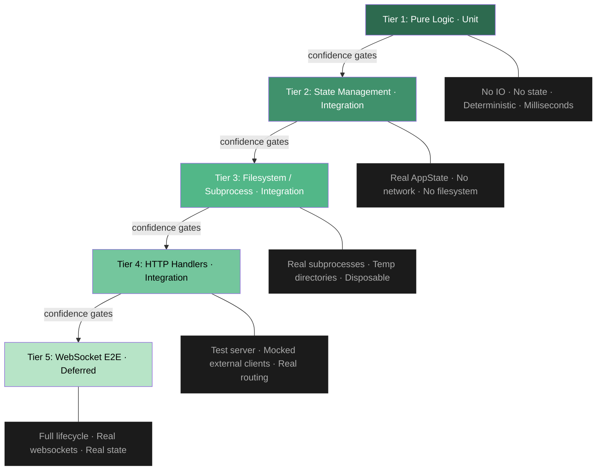

# Lightning Git — Test Concept

## Purpose

A testing strategy for the Lightning Git backend that scales as new modules are added. This document describes the architecture of the test system, not individual test cases.

## Tier Model

Tests are organized into five tiers. Each tier increases in scope, complexity, and execution time. A tier should only be expanded once the tier below it provides sufficient confidence.



### Tier 1: Pure Logic (Unit)

Functions that take inputs and return outputs with no side effects. No IO, no state, no filesystem, no network. Deterministic, runs in milliseconds.

Anything that computes, transforms, compares, or parses without touching external systems belongs here. This is where algorithmic bugs surface: off-by-one errors, incorrect boundary detection, normalization failures.

### Tier 2: State Management (Integration, no network)

Constructs a real "AppState" with real "DashMap" instances but no HTTP server, no database client, and no filesystem access. Validates state transitions: creating, reading, updating, and ensuring mutations are visible through the read path.

This is the tier where ownership and aliasing bugs live. The core question: "when I write state through path A and read it through path B, do I see the write?" Any in-memory state coordination (overlays, user sessions, broadcast channels) is tested here.

Requires a minimal "AppState" constructor that stubs or no-ops external clients (Supabase, Auth). The simplest approach is a test helper that builds "AppState" with real "DashMap" internals and dummy clients.

### Tier 3: Filesystem / Subprocess (Integration)

Interacts with the real filesystem and spawns real subprocesses. For git operations this means creating temporary repositories with "tempfile::TempDir", running actual git commands, and asserting on the results.

No mocking of git. The value of this tier is confirming that the subprocess interface (argument ordering, output parsing, error handling) works against a real git binary. Tests here are slower and require git on the CI runner.

Setup pattern: create temp dir, init repo, add files, commit, create branches, run the function under test, assert, temp dir drops automatically.

### Tier 4: HTTP Handlers (Integration)

Spins up an "actix_web::test::TestServer" with real routing and real "AppState" but mocked external services (Supabase). Validates request/response contracts: correct status codes, response body shapes, and side effects on "AppState".

The permission layer (Supabase JWT validation and project membership checks) needs to be bypassable in tests. Options: trait-abstract the client and inject a mock, or use a compile-time feature flag to skip permission checks in test builds.

Catches wiring bugs: wrong path parameters, missing extractors, incorrect response serialization.

### Tier 5: WebSocket E2E (Deferred)

Full lifecycle: create overlay via HTTP, connect websocket, send edits, verify state mutation, verify broadcast to a second connection, trigger merge conflict detection, verify conflicts reflect live edits.

Deferred until Tiers 1 through 3 are solid. Requires websocket client support in the test harness and is the most complex to set up.

## What Is Not Tested

**Pure wiring.** Route registration, module re-exports, derive macros on data structs. No logic, tested indirectly by everything above.

**Error type specifics.** Tests assert success or failure, not which error variant is returned. Error types will change as the codebase matures.

**External database integration.** Supabase is mocked at Tier 4. No tests hit a live database unless a local Supabase dev instance is added later, at which point it gets its own tier.

## File Organization

```
src/test/
├── mod.rs
├── helpers/
│   └── mod.rs              # AppState builder, temp repo setup, shared utilities
├── *_tests.rs              # Named by domain (merge_logic, overlay_state, git_ops, etc.)
```

Test files are named after the domain they cover, not the source file they correspond to. A single test file may exercise functions from multiple source modules if they belong to the same logical domain.

The "helpers/" module provides reusable setup: constructing "AppState" with dummy clients, creating temporary git repos, and shared assertion utilities.

## Execution

```bash
# Fast: unit + state tests only (Tier 1 + 2)
cargo test --lib

# Full: includes git subprocess tests (Tier 1 + 2 + 3)
cargo test

# Single domain
cargo test merge_logic
```

## Adding Tests for New Modules

When a new module is added to the backend:

1. Determine which tier its core logic belongs to. Pure computation goes to Tier 1. State mutation goes to Tier 2. Subprocess/filesystem goes to Tier 3. HTTP contract goes to Tier 4.
2. Add test cases to an existing domain test file if the logic fits, or create a new "*_tests.rs" file if it represents a new domain.
3. If the module requires new shared setup (a new mock, a new builder), add it to "helpers/".
4. Do not promote to a higher tier until the lower tier provides confidence. A handler test (Tier 4) for a function whose pure logic (Tier 1) is not tested is a waste. The handler test will pass while the logic silently breaks.
