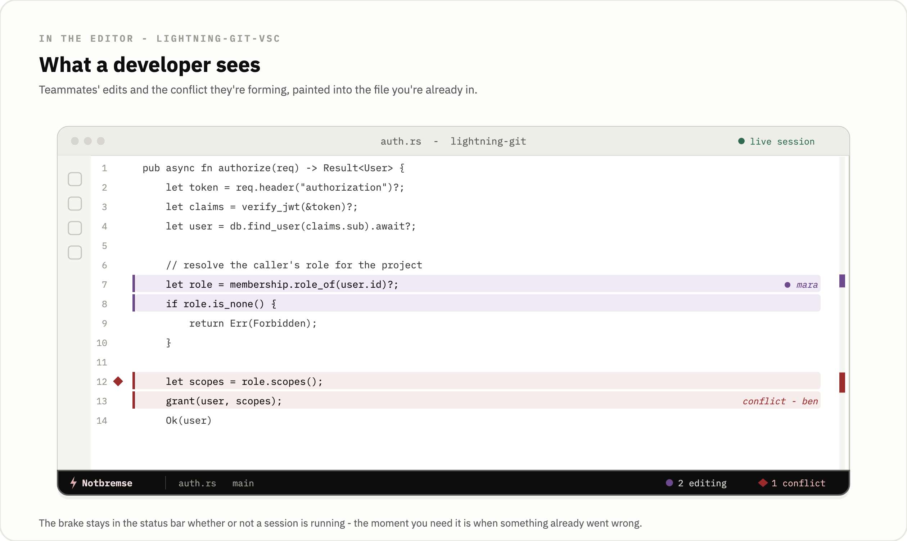
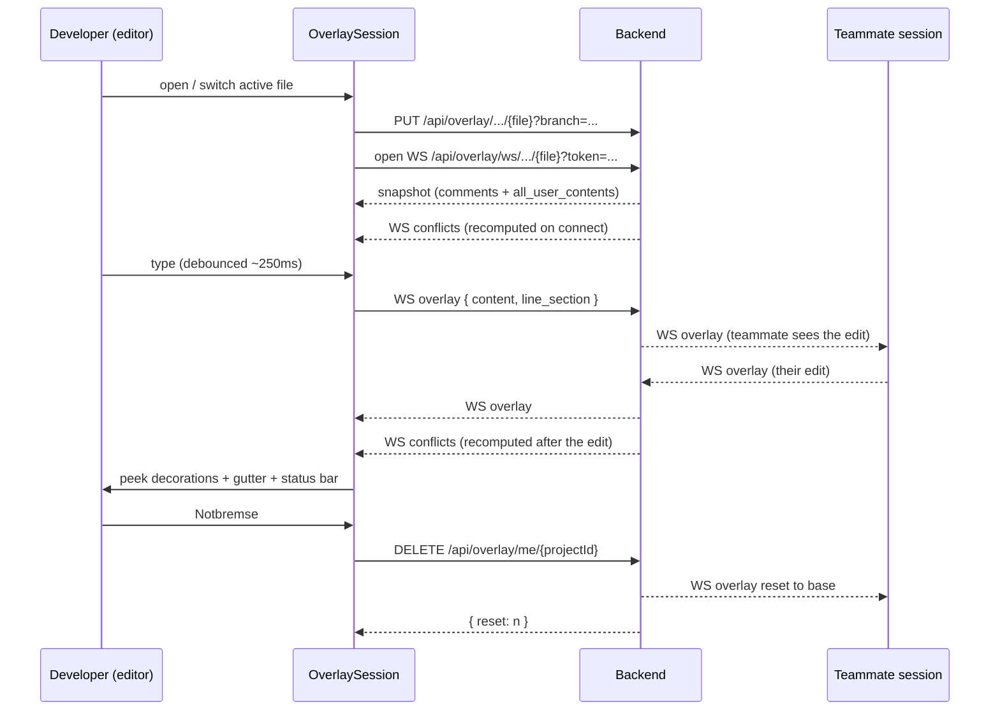

# lightning-git-vsc

  

The Lightning Git VS Code extension. It is the developer's surface for Lightning Git: a live session that paints teammates' uncommitted edits and predicted merge conflicts directly into the editor, and an always-present Notbremse to wipe your live state if you typed something you shouldn't have.

Lightning Git is a real-time visibility layer on top of Git. Git tracks finished states (commits) but says nothing about the hours or days between them, when someone is mid-edit on a file you are also touching and a conflict is quietly forming. Lightning Git fills that gap by mirroring each repo read-only on a backend, holding everyone's in-flight edits as ephemeral overlay state in RAM, and streaming that state to the people who need to see it. This extension is where the code actually lives, so it is where that information is most useful.

The product is three repos against one backend:

- [lightning-git-backend](../backend): the Rust/actix-web server that owns the read-only repo clones, the in-RAM overlay state, the WebSocket realtime layer, and merge-conflict prediction.
- [lightning-git-frontend](../frontend): the Vue 3 web dashboard for non-coding stakeholders: Kanban, the live overlay view, org and project management.
- `lightning-git-vsc` (this repo): the VS Code extension.

It is an early-stage, self-hostable project. [lightning-git.com](https://lightning-git.com) serves only the landing page; there is no public instance, you host it yourself.

<p align="center">
  
</p>

## What a developer sees

<p align="center">
  
</p>

Start a session and the extension begins watching your active editor. As teammates type on the same file from their own machines, their changes arrive over a WebSocket and the extension peeks them inline, a whole-line tint and an italic label showing which teammate changed which line. Another developer in the same file becomes visible without anyone having to ask. A status bar item on the right shows `N editing` and flashes a warning background each time a teammate's keystrokes land, so activity is visible even when you are not looking at the decorated lines. If you want the full picture of a teammate's version, `Lightning Git: View Teammate Change` opens a normal VS Code diff between your file and theirs.

Predicted merge conflicts paint in the gutter before anyone commits. When two people change the same lines in incompatible ways, those line ranges get an orange left border and an overview-ruler tick, and a second status bar item shows `N conflict(s)`. The conflict panel lists each region, grouped by branch and author. A forming conflict shows up while it is still cheap to talk about, hours before either branch reaches a pull request.

The Notbremse (German for emergency brake, kept as-is) sits at the far left of the status bar as a warning-colored `$(zap) Notbremse` button. It is shown the moment the extension activates and stays there whether or not a session is running, because the moment you need it is exactly when something went wrong. Clicking it shows a modal confirm and then resets your server-side overlay on every file in the project back to the committed base. Its purpose is credential safety: if you pasted a token into a file, the brake clears it from the backend's memory and from teammates' views before it spreads further. It is a reactive control. It only helps if you notice, and it cannot recall edits that already went out. The `lightningGit.debounceMs` setting is the other half of the same safety property, a larger debounce delays broadcasting your local edits, which widens the window to hit the brake before a secret syncs to anyone.

## Conflict prediction

The backend is the single source of conflict truth. It recomputes the conflict set whenever a client connects and again on every overlay edit, and pushes the result over the same per-file WebSocket the edits already flow on, as a `conflicts` message. The extension does not compute conflicts itself. An earlier build hand-ported the Rust algorithm into `src/liveConflicts.ts` and fused a local pass with a 60-second `/api/merge` poll; that port and that poll are both gone, along with the `diff` dependency they needed. `OverlaySession` now stores the pushed set as a whole-set replace (`this.conflicts = msg.conflicts`) and renders it, so the editor can never drift from the server and a conflict the backend has resolved simply drops off on the next message.

Rendering is still guarded against thrashing VS Code's IPC, because pushed messages can arrive in bursts while two teammates type. Renders are coalesced through a 60ms `renderTimer`, and `conflictsEqual` does a cheap deep fingerprint of the new set against the last rendered one (lengths, each conflict's range, each hunk's branch, user, range, and content lines), so an identical message returns before touching `setDecorations`, the gutter, or the webview. Two teammates typing at once used to saturate the extension-host channel until VS Code stopped responding to commands; the equality short-circuit plus the edit debounce keeps the channel idle when there is nothing to repaint.

One class of bug shaped the render path: focus. When the conflict-panel webview takes focus, `vscode.window.activeTextEditor` is `undefined`, which would silently drop the tracked file mid-divergence. So the session never reads `activeTextEditor`. `findVisibleEditor` scans `visibleTextEditors` for the tracked file, `applyConflictGutter` iterates the visible editors, and the local document is resolved by path via `findOpenDocument` over `workspace.textDocuments`. Editor resolution is by tracked path, not by focus.

## Session lifecycle

A session is keyed to a project, and the extension finds the project for you rather than asking. On start it reads the workspace's `git remote.origin.url`, normalizes it to `owner/repo` (`normalizeGitUrl` in `src/gitUrl.ts`), and matches it against the projects in your organizations, caching the result in `workspaceState` under `lightningGit.projectId`. Projects themselves are created only in the web frontend; the extension links to one that already exists.

Once a session is running, the active editor drives everything. On each active-editor change, `openDocumentOverlay` reads the current branch with `git rev-parse --abbrev-ref HEAD`, registers the file with the backend over `PUT /api/overlay/{projectId}/{userId}/{file}?branch={branch}` (a 400 is treated as already-registered), and opens the per-file WebSocket at `{wsUrl}/api/overlay/ws/{projectId}/{userId}/{file}?token={jwt}`. The token rides in the query string because the backend accepts the JWT either as an `Authorization` header or as a `?token=` query param, the fallback that lets browser WebSockets authenticate, and the extension uses the query-param form to share one code path with the web client.

Your own edits flow the other way. `onDidChangeTextDocument` queues a send debounced by `debounceMs` (default 250ms); `sendDocumentChange` then transmits the full document text with `line_section: [0, lineCount-1]` over the same socket. Teammate edits, comments, the initial snapshot, and the predicted-conflict set all arrive on that one socket. There is no separate poll for anything. The only clocks are the local edit debounce and short one-shot UI timers (the 60ms render coalesce, the peek auto-hide, the status-bar flash).



On the backend side, the Notbremse is a single in-memory pass: `reset_user_overlays` walks every file overlay in the project, resets the calling user's content to the cached base, and broadcasts the reset on each file's channel so teammates' views snap back. It never touches git, so recovery is instant and cannot damage history.

## Commands

All command ids live under the `lightning-git.*` namespace. Note that the settings namespace is `lightningGit` instead, the two differ.

| Command id | Title |
|---|---|
| `lightning-git.register` | Lightning Git: Register |
| `lightning-git.login` | Lightning Git: Login |
| `lightning-git.logout` | Lightning Git: Logout |
| `lightning-git.startSession` | Lightning Git: Start Session |
| `lightning-git.stopSession` | Lightning Git: Stop Session |
| `lightning-git.viewChange` | Lightning Git: View Teammate Change |
| `lightning-git.peekTeammates` | Lightning Git: Peek Teammate Changes |
| `lightning-git.peekConflicts` | Lightning Git: Peek Merge Conflicts |
| `lightning-git.notbremse` | Lightning Git: Notbremse (Wipe Live Session) |

`register`, `login`, `logout`, `startSession`, `stopSession`, `viewChange`, and `notbremse` register at activation. `peekTeammates` and `peekConflicts` register inside `OverlaySession.start()`, so they only do anything during a live session and bind to the two status bar items.

## Settings

Configured under `lightningGit` (Settings UI title "Lightning Git"):

| Setting | Type | Default | Description |
|---|---|---|---|
| `lightningGit.apiUrl` | string | `http://localhost:8080` | Backend API endpoint |
| `lightningGit.wsUrl` | string | `ws://localhost:8080` | WebSocket server URL |
| `lightningGit.debounceMs` | number | `250` | Delay before broadcasting local edits to teammates. Lower values feel more live; higher values give a wider window to clear accidentally typed credentials with the Notbremse before sync. |

## How it talks to the backend

The extension never reaches Supabase or GitHub directly. Everything goes through the backend over one axios instance with `baseURL = apiUrl`. A request interceptor injects the `Bearer` token; a response interceptor handles `401` with a single-flight refresh and one retry.

Authentication uses `POST /register`, `POST /login` (returns `access_token`, `refresh_token`, `user_id`), and `POST /refresh`. `AuthManager.refresh()` memoizes an `inFlightRefresh` promise so that when several requests `401` at once they share one `/refresh` call rather than each burning a refresh token, and an `_retried` flag on the original request stops infinite retry loops. Tokens are stored in `context.secrets` (VS Code SecretStorage); email and `userId` go in `globalState`.

The endpoints the session uses:

| Method | Path | Purpose |
|---|---|---|
| `PUT` | `/api/overlay/{projectId}/{userId}/{file}?branch={branch}` | register/refresh this file's overlay |
| `GET` | `/api/overlay/ws/{projectId}/{userId}/{file}?token={jwt}` | per-file overlay WebSocket (edits, comments, snapshot, pushed conflicts) |
| `DELETE` | `/api/overlay/me/{projectId}` | Notbremse; returns `{ reset: n }` |
| `GET` | `/api/projects/{id}/members` | resolve `user_id` to display name for labels |

Best-effort getters such as `listProjectMembers` swallow errors and return `[]`, because a missing member list should degrade the UI rather than break the session. WebSocket payloads are parsed through `parseWsMessage`, which validates the shape and returns `null` for anything malformed instead of throwing.

## Local development

```bash
npm ci
npm run compile      # tsc -p ./
npm run watch        # tsc -watch -p ./ during development
npm run lint         # eslint src
npm test             # vitest run
```

Press F5 in VS Code to launch an Extension Development Host. Point `lightningGit.apiUrl` and `lightningGit.wsUrl` at a running [backend](../backend) (defaults assume `localhost:8080`). You will need an account, register from the command palette, and the workspace must be a git checkout whose `origin` matches a project that already exists in the web frontend.

Runtime dependencies are `axios` and `ws`. The extension targets VS Code `^1.74.0` and compiles to `./out/extension.js`.

## Tests

`vitest run` covers the pure logic that does not need a VS Code host: `conflictsEqual` (the repaint-suppression fingerprint), `normalizeGitUrl` (`gitUrl.ts`, the remote-to-`owner/repo` normalization that drives project detection), `parseWsMessage` (the WebSocket message contract, the stable cross-repo shape), and `getErrorMessage` (`errorMessage.ts`, error-to-string for user-facing notices). The WebSocket message shape is the contract shared with the backend and the web client, so `parseWsMessage` is tested against it directly.

## Project layout

```
src/
  extension.ts        activation, command registration, project auto-detect, Notbremse item
  overlaySession.ts   the session: WS lifecycle, decorations, status bars, render path
  conflictsEqual.ts   conflict-set fingerprint for repaint suppression
  conflictPanel.ts    the conflict webview panel
  parseWsMessage.ts   validate and type incoming WebSocket messages
  gitUrl.ts           normalize a git remote URL to owner/repo
  errorMessage.ts     error-to-string for user-facing notices
  client.ts           axios instance, endpoints, 401 single-flight refresh + retry
  auth.ts             SecretStorage tokens, register/login/refresh
```

CI lives in the monorepo at `.github/workflows/ci.yml` and runs only when a change touches `extension/`: `npm ci`, `npm run compile`, `npm run lint`, and `npm test`.

## Scope and limitations

This extension is an early-stage prototype, and a few things are deliberately out of scope.

The conflict algorithm now lives in exactly one place, the Rust backend, and the extension renders the set the backend pushes over the WebSocket instead of re-deriving it. The two hand-ported client copies that used to drift, and the only reason the algorithm could disagree across surfaces, are gone. The pure logic the extension does still own (URL normalization, message parsing, the repaint fingerprint) is covered by `vitest`; the VS Code host integration itself is not exercised by automated tests.

The backend holds all overlay state in RAM on a single instance, so live state is lost on restart and the system does not scale past one backend process without shared state and cross-instance broadcast. The Notbremse is reactive by nature, as noted above.

For the why behind the design, and for the conflict-prediction algorithm in full, see the [backend](../backend) and [lightning-git.com](https://lightning-git.com).
