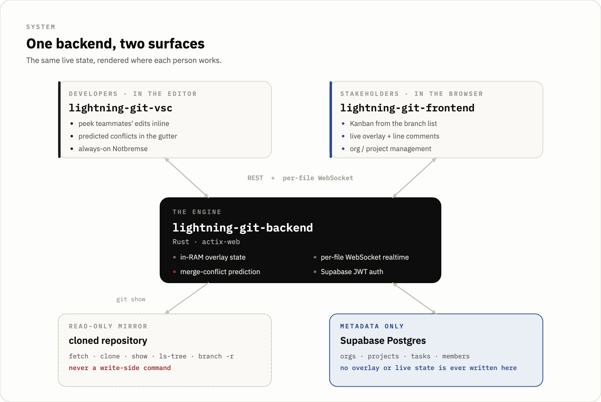
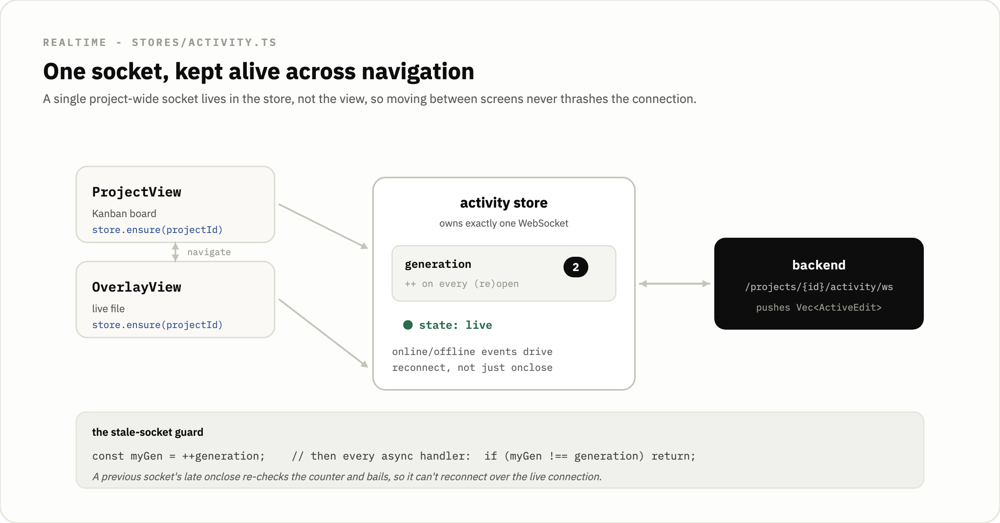

# lightning-git-frontend

   

The Vue web surface for Lightning Git: a dashboard that renders the same realtime overlay data as the editor extension, plus the organization and project management screens.

It is an early-stage, self-hostable project. [lightning-git.com](https://lightning-git.com) serves only the landing page; there is no public instance, you host it yourself.

This web app is one of three packages in the [Lightning Git monorepo](../README.md), alongside the [backend](../backend) (Rust / actix-web) and the [extension](../extension), the VS Code developer surface.

<p align="center">
  
</p>

## Why a web surface exists alongside the editor extension

The extension lives where developers work, so a developer already sees teammates' edits and predicted conflicts in their own editor. But not everyone on a team opens VS Code. A Scrum Master, a Product Owner, or anyone coordinating the work needs the same live picture: who is editing which file right now, where two branches are diverging, what comments sit on which line, all without installing an editor or touching a repository. The web app renders exactly that. It reads the same activity and overlay streams the extension reads and projects them into a browser dashboard, so a non-coding stakeholder watches the live state of the code without ever cloning it.

Projects, organizations, and members are created and managed here, not in the extension; the extension only links to a project that already exists by matching the git remote. So this repo is both the read-only window for stakeholders and the management console for the whole product.

## How the realtime layer is wired

There are two kinds of socket. One is project-wide and shows the activity feed (who is editing what across the whole project). The other is per-file and carries the detailed overlay of a single file. The frontend treats them differently on purpose, because they have different lifetimes.

### One shared activity socket per project

<p align="center">
  
</p>

The project-wide activity socket is owned by a Pinia store (`stores/activity.ts`), not by a view. `ensure(projectId)` opens it only if the project changed or the socket is dead, and the store is reused across navigation between the Kanban board (`ProjectView`) and the live file view (`OverlayView`). `OverlayView`'s `onUnmounted` disposes its own per-file socket but deliberately does not dispose the activity store, because tearing the activity socket down and rebuilding it on every route change would make it thrash for no reason.

Keeping one long-lived socket across navigation creates the classic WebSocket race: a previous socket's delayed `onclose` can fire after a new socket has already opened and schedule a reconnect on top of it. The store guards against that with a monotonic `generation` counter. `open()` captures `const myGen = ++generation`, and every async handler starts with `if (myGen !== generation) return`, so a stale socket's `onopen`, `onmessage`, `onclose`, and `onerror` all short-circuit and cannot touch state or schedule a reconnect that races the live connection.

The store also drives reconnect from the browser's `online` and `offline` events, because a dropped network does not reliably fire `onclose` on an already-open socket. DevTools "Offline" in particular leaves the socket reporting `OPEN`, which would otherwise pin the status at `live` forever. `handleOffline` bumps the generation and closes the dead socket; `handleOnline` calls `open()` immediately rather than waiting for a timeout, and the backend pushes the current edits on the fresh connection.

### Per-file overlay sockets

Each opened file gets its own `OverlayWebSocket` (`services/ws.ts`). It auto-reconnects 3 seconds after an unexpected close, but never after the caller disposes it. The guard is a `disposed` flag set *before* `socket.close()` is called, so the async `onclose` reconnect path sees `disposed === true` and short-circuits. Without that ordering, `dispose()` would close the socket, the async `onclose` would then fire on an instance the view had already discarded, and an orphan socket would reconnect itself back to life.

The token rides in the query string (`?token=...&echo=true`) because browsers cannot set headers on a WebSocket handshake. `echo=true` is what makes the web viewer see its own edits reflected back; the VS Code side omits it so a typist there does not fight their own cursor. The backend reads that flag and filters overlay echoes per subscriber, while always delivering comment events so the originating client learns the server-assigned id. The message shape (`WsMessage`) is a tagged union mirroring the backend's `WsBroadcast`:

```ts
export type WsMessage =
  | { kind: "overlay"; user_id: string; content: string; line_section: [number, number] }
  | { kind: "comment_created"; id: string; user_id: string; line: number; text: string; created_at: number }
  | { kind: "comment_deleted"; id: string }
  | { kind: "snapshot"; comments: Comment[]; all_user_contents: OverlayUserView[] }
  | { kind: "conflicts"; file: string; conflicts: MergeConflict[] };
```

The `snapshot` message arrives on subscribe and seeds both the existing comments and the current teammate contents in one shot, so there is no HTTP follow-up to populate the view. The `conflicts` message carries the backend's predicted-conflict set for the file; the backend pushes it on connect and again after every edit, and the view replaces its whole set on each one.

## Client-side overlay projection

<p align="center">
  
</p>

The live file view projects every contributor's content into a per-line view for attribution, and renders the predicted-conflict set the backend pushes over the WebSocket.

`utils/overlay.ts` `computeProjectedLines` runs an LCS diff (`diffArrays` from the `diff` package) of each user's content against the base, so a single inserted line does not cascade-tag every line below it as that user's edit. Lines are tagged last-writer-wins but prefer the most recent non-empty contributor, because otherwise one teammate clearing their whole file would blank the projection for everyone. Pure deletions are surfaced as untagged base lines so the viewer still sees the file's structure rather than a hole.

Conflict prediction itself is not done here. The backend recomputes the conflict set on every overlay edit and pushes it over the per-file socket as a `conflicts` message, and the view renders that set directly. An earlier build hand-ported the Rust algorithm into `utils/merge.ts` and fused a local pass with a slower poll; that port is gone, which removes a whole class of client/server drift and the chore of keeping two copies of the algorithm in step.

`mergeConflicts` is a `shallowRef` because each `conflicts` message carries the whole set and replaces the previous one wholesale, and deep-proxying every hunk on each push caused page hitches. The replacement is outright, with no client-side union or fallback, so a conflict the backend has resolved simply drops off on the next message rather than lingering. Rendering is capped at `MAX_RENDERED_LINES = 1500` to avoid freezing on huge files, while the backend still computes conflicts over the full content.

Per-user colors are assigned by position, not by hashing. `OverlayView` builds `knownUserIds` as a sorted array of every id seen in overlays, comments, and the current user, and `colorIndex(userId)` returns the array index modulo the palette length, with a char-hash fallback only for an id not yet in the set. Five users get five distinct colors, which a plain hash-mod could not guarantee on a small population, and the result is stable across reloads.

## Auth and the refresh interceptor

Auth uses JWT access and refresh tokens. The access token persists in `localStorage` under `token`, the refresh token under `refreshToken`, the user under `user`, and the selected org under `currentOrgId`. The request interceptor in `services/api.ts` attaches `Authorization: Bearer <token>` to every call.

Refresh is handled by inverting the dependency so the store and the axios instance do not import each other in a cycle. The api module exposes `onUnauthorized(handler)` and keeps a module-level `refreshHandler`; the auth store registers its `refresh` function through it at construction. On a 401, the response interceptor marks the failed config with `_retried`, skips the call if it is the `/refresh` call itself, awaits `refreshHandler()`, rewrites the `Authorization` header with the fresh token, and replays the request via `api.request`. If refresh returns `null` (no usable refresh token), the handler has already cleared auth and the interceptor redirects to /login with `window.location.replace('/login')` (unless the user is already there) so they are not stuck on a page they cannot load.

The refresh itself is single-flight. `auth.ts` `refresh()` guards with a module-scoped `inFlight` promise, so when a page fires many parallel requests that all 401 at once, they share one refresh call instead of each burning a refresh token.

## Routes

The router (`src/router/index.ts`) splits into guest-only auth pages and authenticated app pages scoped under an organization; the root path redirects into the app.

| path | name | view | meta | purpose |
|------|------|------|------|---------|
| `/` |, | redirect → `dashboard` |, | root redirects into the app |
| `/login` | login | `LoginView.vue` | `requiresGuest` | sign in |
| `/register` | register | `RegisterView.vue` | `requiresGuest` | sign up |
| `/orgs` | orgs | `OrgListView.vue` | `requiresAuth` | list / select organizations |
| `/orgs/new` | orgs-new | `OrgCreateView.vue` | `requiresAuth` | create an organization |
| `/orgs/:id/members` | org-members | `OrgMembersView.vue` | `requiresAuth` | manage org members |
| `/dashboard` | dashboard | `DashboardView.vue` | `requiresAuth, requiresOrg` | projects board for the selected org |
| `/projects/new` | projects-new | `ProjectCreateView.vue` | `requiresAuth, requiresOrg` | create a project |
| `/projects/:id` | project | `ProjectView.vue` | `requiresAuth, requiresOrg` | Kanban board for the project |
| `/projects/:id/overlay` | overlay | `OverlayView.vue` | `requiresAuth, requiresOrg` | live file overlay view |
| `/projects/:id/members` | project-members | `ProjectMembersView.vue` | `requiresAuth, requiresOrg` | manage project members |

The guard (`router.beforeEach`) is three rules: a `requiresAuth` route redirects to `login` when the user is not authenticated, a `requiresGuest` route redirects to `dashboard` when they already are, and a `requiresOrg` route redirects to `/orgs` when no org is selected.

## Pinia stores

State lives in five stores under `src/stores/`:

- `auth`: user, token, and refreshToken hydrated from `localStorage`; `isAuthenticated`; `login` / `register` / `logout`; the single-flight `refresh` registered into the api layer via `onUnauthorized`.
- `org`: the org list and `currentOrgId` (persisted under `currentOrgId`); fetch / create / rename / `transferOwnership` / remove / select / clear; member management; `roleIn(orgId)` returning `'owner' | 'member' | null`.
- `project`: projects, current project, tasks, and members; fetch and CRUD; `wipeMyOverlays` (the Notbremse); `setTaskArchived` / `setTaskColumn`; `myRole` returning `'admin' | 'member' | null`.
- `activity`: the shared project-wide WebSocket described above, exposing `edits`, a `state` of `'closed' | 'connecting' | 'live'`, `ensure(projectId)`, and `dispose()`.
- `toast`: the toast list with `push` / `dismiss` plus `info` / `success` / `error` helpers, default TTL 4500 ms.

## The board and the Notbremse

The Kanban board (`ProjectView`) tracks branches as tasks across four columns (`todo`, `in_progress`, `review`, `merged`), dragged with `vuedraggable`. Remote branches register as tasks automatically; columns are moved by hand. Archiving toggles via `PATCH /api/tasks/{id}/archive` and a column move via `PATCH /api/tasks/{id}/column`.

The Notbremse (kept as the German coinage for "emergency brake") resets the calling user's in-flight overlays in a project back to the committed git base, via `DELETE /api/overlay/me/{projectId}`. It affects only the caller's own overlays and is gated server-side by project membership. Its reason for existing is credential safety: if a secret lands in a live edit, one click discards that user's uncommitted typing across every file at once. It is a reactive control, it only helps if the user notices, and it cannot recall edits that already streamed out to teammates before the wipe.

## Local development

```bash
npm install
npm run dev          # vite dev server on :5173
npm run build        # vue-tsc -b && vite build
npm run preview      # serve the production build
npm run test         # vitest run
npm run test:watch   # vitest in watch mode
```

The backend's CORS in the prototype hard-wires `http://localhost:5173`, so the dev server is expected on that port. Two environment variables point the app at the backend; both have localhost defaults and live in `.env.example`:

| var | default | purpose |
|-----|---------|---------|
| `VITE_API_BASE_URL` | `http://localhost:8080` | REST base for the axios client |
| `VITE_WS_URL` | `ws://localhost:8080` | base for both the activity and per-file overlay sockets |

Run the [lightning-git-backend](../backend) locally first; it exposes the `/api` routes and the two WebSocket endpoints this app connects to.

## Testing

Tests run under Vitest with `@vue/test-utils` and `happy-dom` as the environment. There are 54 tests across seven spec files, and the suite is green.

- `utils/overlay.spec.ts` (18): `buildTree` plus `computeProjectedLines`, the LCS projection and its last-writer-wins tagging, including pure deletions surfaced as untagged base lines and the overlapping-edit case that once spun the projection into a non-terminating loop.
- `stores/auth.spec.ts` (7): the single-flight refresh and the session lifecycle.
- `services/api.spec.ts` (6): the 401 interceptor refreshing once and retrying once, and never refreshing the `/refresh` call itself.
- `components/FileTreeNode.spec.ts` (7): the file-tree component.
- `router/guard.spec.ts` (6): the auth, guest, and org access rules.
- `utils/confirm.spec.ts` (6): the confirm and prompt dialog promise bridge.
- `services/ws.spec.ts` (4): the per-file `OverlayWebSocket`, including that a disposed socket never reconnects.

Run them with `npm test`.

## Project layout

```
src/
  views/        route components incl. OverlayView (live file), ProjectView (Kanban),
                auth, org & project management screens
  stores/       five Pinia stores: auth, org, project, activity, toast
  services/     api.ts (axios + refresh interceptor), ws.ts (per-file OverlayWebSocket)
  utils/        overlay.ts (projection, LCS diff)
  components/   NavBar, FileTreeNode, dialogs, ToastHost, TabStrip, icons
  router/       route table + the auth/guest/org guard
  types/        shared API types
```

## Scope and limitations

This is an early-stage prototype, not production software, and a few things are deferred on purpose.

Conflict prediction now lives only in the Rust backend; this app renders the conflict set pushed over the WebSocket, so there is no ported copy to drift. Live overlays, predicted conflicts, and comments all arrive over the WebSocket. Comments in the backend are in-memory only and are lost on restart. The backend keeps overlay state in a single in-memory instance with an in-process broadcast, so running more than one backend would need shared state. The backend's CORS is hard-wired to the localhost dev origin and would need to be environment-driven for a real deployment, and the WebSocket connect path on the backend checks a valid JWT but does not verify project membership on the socket itself.
